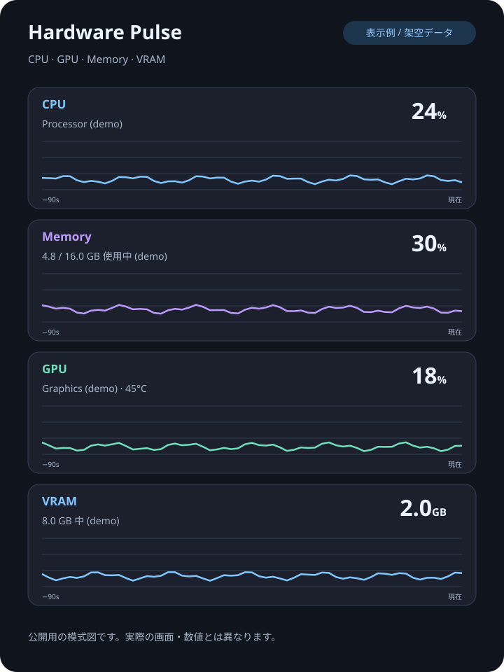

# Hardware Pulse

Hardware Pulse は、Windows 11 x64 向けのハードウェア状態モニターです。CPU、GPU、メモリ、VRAM、プロセスの状態をひとつのデスクトップ画面で確認できます。現在は v0.1.1 preview です。

この公開ページは配布用ドキュメントです。アプリケーション本体のソースコードは公開していません。

## ダウンロード

[Hardware Pulse v0.1.1 preview](https://github.com/null-wave-app/hardware-pulse/releases/tag/v0.1.1)

[**Windows版 ZIPをダウンロード**](https://github.com/null-wave-app/hardware-pulse/releases/download/v0.1.1/HardwarePulse-v0.1.1-win-x64.zip)

1. ZIPをダウンロードして、任意のフォルダーにすべて展開します。
2. `HardwarePulse.exe` を起動します。インストーラーや .NET の追加インストールは不要です。
3. カードをクリックすると詳細、右上の「設定」から表示を変更できます。

Windows 11 x64、ビルド 26200 で動作確認しています。ほかの Windows バージョン、CPU、GPU、ドライバー構成は確認していません。実行ファイルには .NET ランタイムが含まれています。

初回起動時に Windows SmartScreen などの警告が表示される場合があります。実行ファイルは署名されていません。PCのセキュリティ設定によっては実行がブロックされることもあります。

## できること

- CPU の温度、負荷、クロックを表示
- GPU の温度、負荷、クロック、電力、VRAM 使用量を表示
- システムメモリの使用率と使用量を表示
- メトリックカードの表示・順序・テーマ・アクセントカラー・表示倍率を設定
- グラフ、クロック、電力、統計表示を切り替え
- CPU・メモリ・GPU・VRAM のカードから、それぞれの使用量の多い順にプロセスを確認
- CPU の詳細は「プロセス」「コア別」タブで切り替え
- プロセスを検索、列の表示・順序・幅を変更、グループの詳細を表示
- ローカルLLM優先のソフトウェア描画モード（次回起動から反映）
- 選択したプロセスを終了

プロセス終了は未保存の作業を失う可能性があります。対象を確認してから実行してください。

## CPU 温度について

CPU 温度は環境によって取得できない場合があります。Intel / AMD の構成では、LibreHardwareMonitor の対応状況、PawnIO ドライバー、UAC、管理者権限が影響することがあります。Hardware Pulse は温度取得用ドライバーを自動導入しません。温度が「–」のままでも、アプリの表示不具合とは限りません。

## 設定とアンインストール

アンインストールはアプリを終了し、展開したフォルダーを削除します。

設定は `%APPDATA%\HardwarePulse\settings.json` に保存されます。アプリを削除しても設定ファイルは自動削除されません。設定を初期化する場合は、アプリを終了してからこのファイルを削除してください。

Hardware Pulse は自動更新しません。新しい版は Releases ページから手動で確認してください。

## 画像について

画面構成を紹介する模式図です。機種名・数値はすべて架空で、実際のスクリーンショットとは異なります。

## サポート

不具合報告や提案は [Issues](https://github.com/null-wave-app/hardware-pulse/issues) からお願いします。詳しくは [SUPPORT.md](SUPPORT.md) をご覧ください。

## 使用ライブラリ

同梱ライブラリのライセンス、著作権表示、対応するソースの入手先は [THIRD-PARTY-NOTICES.txt](THIRD-PARTY-NOTICES.txt) に記載しています。

## English summary

Hardware Pulse is a Windows 11 x64 desktop hardware monitor preview. It shows CPU, GPU, memory, VRAM, and process information, with configurable cards, graphs, themes, and process columns. The v0.1.1 preview is distributed as **HardwarePulse-v0.1.1-win-x64.zip** from the [GitHub release](https://github.com/null-wave-app/hardware-pulse/releases/tag/v0.1.1).

Windows 11 x64 build 26200 is the only verified environment. Other hardware and driver combinations are unverified. The executable bundles .NET and is unsigned. CPU temperature availability depends on the hardware, LibreHardwareMonitor support, PawnIO, UAC, and elevation. The app does not install drivers or auto-update. Ending processes can lose unsaved work. Settings are stored at `%APPDATA%\HardwarePulse\settings.json`.

The application source code is not published in this distribution repository. See [THIRD-PARTY-NOTICES.txt](THIRD-PARTY-NOTICES.txt) for redistributed dependency notices. Please use [GitHub Issues](https://github.com/null-wave-app/hardware-pulse/issues) for support.
